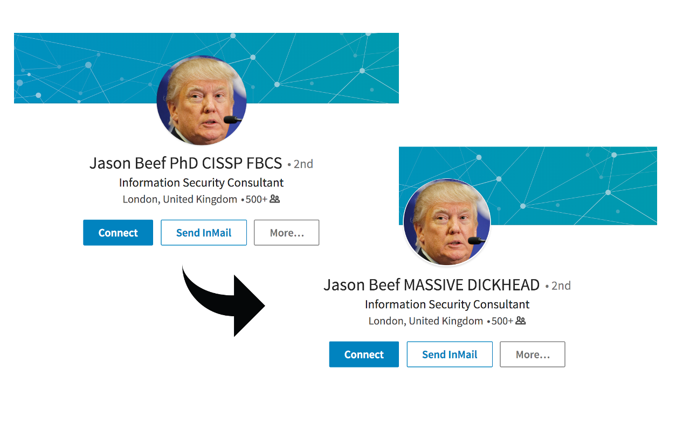

# DICKHEAD

**Finds and identifies DICKHEADS on LinkedIn.**

Don't you just hate people who put their qualifications or certifications AFTER their name on LinkedIn? Don't you just think DICKHEAD! Well now there's an add-on for that.

DICKHEAD replaces certifications after peoples names on LinkedIn with, well, "DICKHEAD". The more certifications they have, the bigger the DICKHEAD. 3 certifications? "MASSIVE DICKHEAD".

Proven to massively improve your LinkedIn browsing experience.

## Installation

Via the Chrome Web Store: https://chrome.google.com/webstore/detail/bfddnpmbdehcgbojeooblmglepmmbjck - just click "Add to Chrome"!

You can also `pull` this repository and then "Load unpacked extension" via the Chrome Extensions panel.
